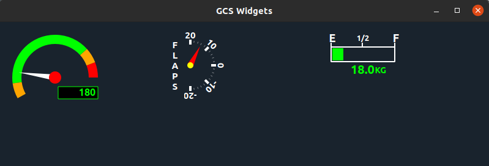

# GCSWidgets
Custom widgets which can be used in UAV/Drone ground control station development.

Currently supports following widgets
1. Dial (for Engine or Rotor RPM)
2. Fuel Indicator
3. Flap Indicator (for fixed wing UAV)

How to use
==========
Each custom widget is implemented in separate `.cpp` and `.h` file. To use the widget copy the corresponding `.cpp` and `.h` file into your project. You can either create the widget dynamically or through Qt designer form.

To use Dial widget, copy `dial.cpp` and `dial.h` files.   
To use Flap widget, copy `flapindicator.cpp` and `flapindicator.h` files.  
To use Fuel widget, copy `fuelindicator.cpp` and `fuelindicator.h` files.  

This repo contains a test program to demonstrate how to use these widgets.

I'll be adding more widgets in the future.
